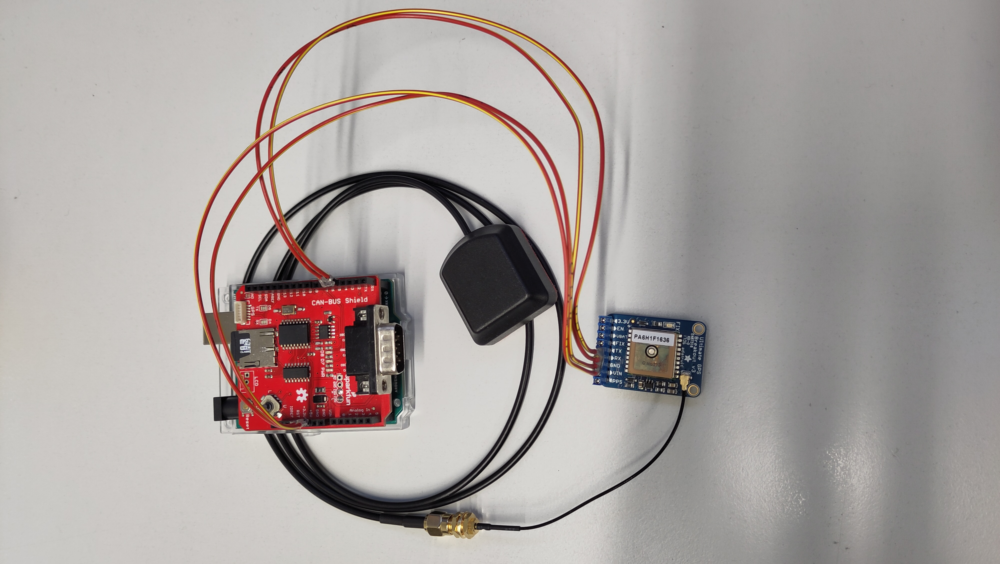

# glr-2024e-datalogger

This project demonstrates a data logging system for the GLR2024e car using an Arduino, CAN Bus communication, GPS module and an SD card for data storage. 
The system retrieves vehicle CAN Bus data and GPS location data, then logs them to an SD card for later analysis.

## Features

- **CAN Bus Communication:** Reads and processes CAN messages from a vehicle.
- **GPS Integration:** Logs real-time latitude, longitude, date, and time.
- **SD Card Logging:** Stores GPS and CAN Bus data for offline analysis.

## Hardware Requirements

**main components** 
   1. **Arduino Uno Board** [Link](https://store.arduino.cc/en-de/products/arduino-uno-rev3)
   2. **Adafruit Ultimate GPS Module** [Link](https://learn.adafruit.com/adafruit-ultimate-gps/overview)
   3. **SparkFun CAN-Bus Shield** [Link](https://www.sparkfun.com/can-bus-shield.html)

**Additional items**
   1. **Connector Shield to GPS** [Example link](https://eu.robotshop.com/de/products/pololu-6-poliges-weibliches-jst-sh-kabel-12-cm)
   2. **Connector IPEX to SMA** [Example link](https://eu.robotshop.com/products/dfrobot-ipex-to-sma-female-connector-cable-2x)
   3. **External GPS antenna SMA** [Example link](https://co-en.rs-online.com/product/siretta/alpha4a-1m-smam-s-s-26/73525599/)
   4. **FAT32 formatted SD card**
   5. **RTC Battery CR1220 for GPS**

## Software Requirements

1. **Arduino IDE** [Link](https://www.arduino.cc/en/software)
2. **Libraries**:
   - `SPI` (Included in Arduino standard libraries)
   - `SD` (Included in Arduino standard libraries)
   - `SoftwareSerial` (Included in Arduino standard libraries)
   - `TinyGPS` (Exist in the Arduino library manager)
   - `Canbus.h` [Manual import: SparkFun CAN-Bus Library](https://github.com/sparkfun/SparkFun_CAN-Bus_Arduino_Library)
   - `mcp2515.h` [Manual import: SparkFun CAN-Bus Library](https://github.com/sparkfun/SparkFun_CAN-Bus_Arduino_Library)
   - `mcp2515_defs.h` [Manual import: SparkFun CAN-Bus Library](https://github.com/sparkfun/SparkFun_CAN-Bus_Arduino_Library)

## How It Works

1. **Setup:**
   - Initializes GPS, CAN Bus, and SD card modules.
   - Displays initialization status on the Serial Monitor.

2. **Loop:**
   - Continuously reads GPS data and logs it to the SD card.
   - Checks for incoming CAN messages and logs them to the SD card.

3. **Logging:**
   - Data is logged to `log-<session>.csv` on the SD card, `<session>` is an incrementing file counter after each power reset of the datalogger.
   - Format of a logged line:  
     `<timestamp>,<year>-<month>-<day> <hour>:<minunte>:<second>,<canHeader>,<canData>,<latitude>,<longitude>`
   - `<timestamp>` represents the time of the arduino in milliseconds since startup.
   - `<year>-<month>-<day> <hour>:<minunte>:<second>` represents date and time provided by the gps, these fields can hold unusable data while gps has not found a lock.
   - `<canHeader>` and `<canData>` hold header and data of a can message, when these are filled, the longitude and latitude fields are empty.
   - `<latitude>` and `<longitude>` hold the gps position, when these fields are filled, the can fields are empty.

